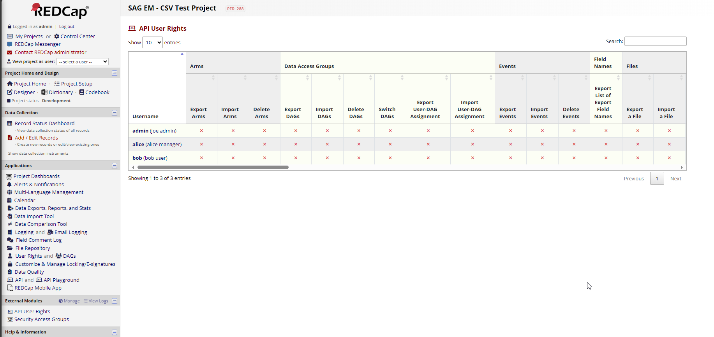
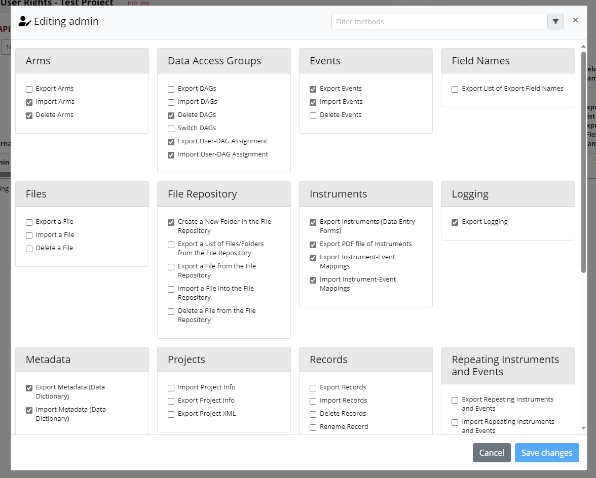

# API User Rights

## Description
This external module allows users with User Rights permission in a project to control access to individual API methods. For example, you can allow a user to access the `Export Reports` method, but not the `Import Records` endpoint.

*Example of the API User Rights link on the project page*

*API User Rights editor*

## Installation
Install through the REDCap Repo

## Configuration
No system or project configuration is required. Once installed and enabled in a project, users with User Rights permission will see a project link called `API User Rights`. This links to a page that allows them to select which API methods they want to allow users to access.

## Changelog

Version | Release Date | Description
----|----|----
1.0.0| 2023-10-09 | Initial release

