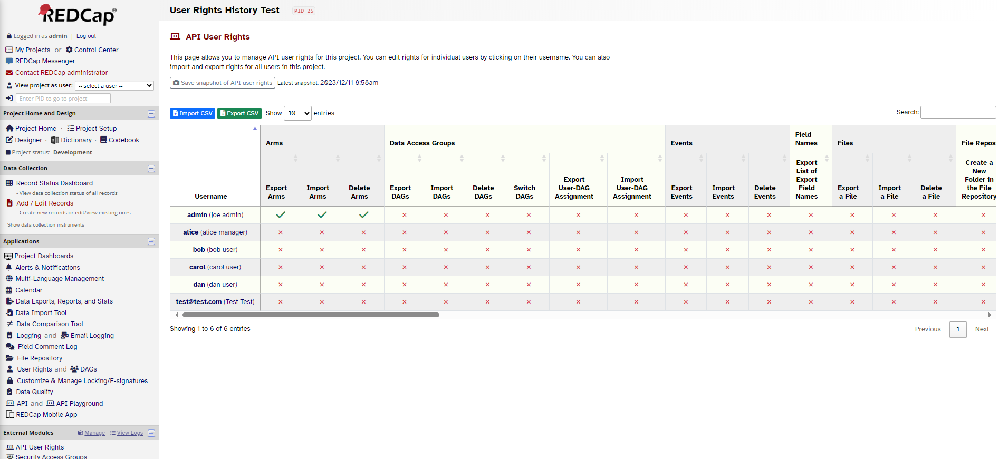

# API User Rights

## Description
This external module allows users with User Rights permission in a project to control access to individual API methods. For example, you can allow a user to access the `Export Reports` method, but not the `Export Records` endpoint.

*Example of the API User Rights link on the project page*

*API User Rights editor*

*Filtering methods in the editor*

*Importing a CSV file*

## Installation
Install through the REDCap Repo

## Configuration
No system or project configuration is required. Once installed and enabled in a project, users with User Rights permission will see a project link called `API User Rights`. This links to a page that allows them to select which API methods they want to allow users to access.

## Changelog

| Version | Release Date | Description                                 |
| ------- | ------------ | ------------------------------------------- |
| 1.1.1   | 2023-12-09   | Bug fix                                     |
| 1.1.0   | 2023-12-07   | Added ability to import/export CSV files    |
| 1.0.4   | 2023-12-04   | Bug fix and aesthetic changes to the editor |
| 1.0.3   | 2023-10-17   | Bug fix and aesthetic changes to the editor |
| 1.0.2   | 2023-10-16   | Added filter bar to API User Rights editor  |
| 1.0.0   | 2023-10-12   | Initial release                             |

