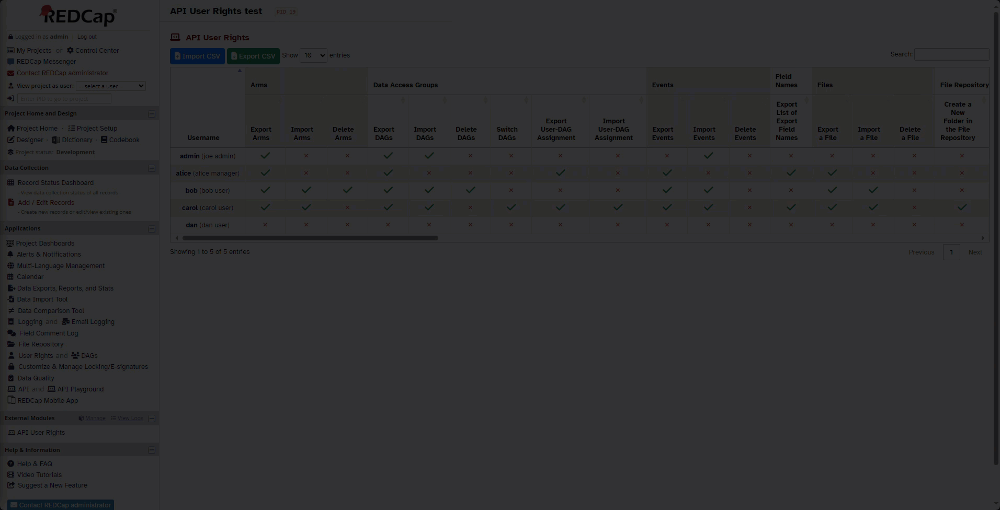

# API User Rights

## Description
This external module allows users with User Rights permission in a project to control access to individual API methods. For example, you can allow a user to access the `Export Reports` method, but not the `Export Records` endpoint.

*Example of the API User Rights link on the project page*

*API User Rights editor*

*Filtering methods in the editor*

*Importing a CSV file*

***History snapshots*** - *Snapshots are automatically taken when user rights are updated via CSV import and can manually be taken at any time.*

## Installation
Install through the REDCap Repo

 Once installed and enabled in a project, users with User Rights permission will see a project link called `API User Rights`. This links to a page that allows them to select which API methods they want to allow users to access.

## Configuration

### Default Rights

There is both a system-level and project-level configuration for the set of API User Rights that will be applied to users in a project by default. The base level default is to disallow any access to the API by default. However, this can be changed by selecting the API methods that should be allowed by default.

There is a corresponding project-level configuration that allows you to override the system-level default. This lets individual projects define the set of API methods they want to allow by default.

## Changelog

See the Releases page for full descriptions of changes.

| Version | Release Date | Description                                                        |
| ------- | ------------ | ------------------------------------------------------------------ |
| 2.1.0   | 2024-10-18   | Support for new Randomization api method. Add translation ability. |
| 2.0.0   | 2023-12-13   | Breaking change in how rights are represented internally.          |
| 1.2.0   | 2023-12-11   | History snapshots, New default rights configuration, and Bug fix   |
| 1.1.1   | 2023-12-09   | Bug fix                                                            |
| 1.1.0   | 2023-12-07   | Added ability to import/export CSV files                           |
| 1.0.4   | 2023-12-04   | Bug fix and aesthetic changes to the editor                        |
| 1.0.3   | 2023-10-17   | Bug fix and aesthetic changes to the editor                        |
| 1.0.2   | 2023-10-16   | Added filter bar to API User Rights editor                         |
| 1.0.0   | 2023-10-12   | Initial release                                                    |

